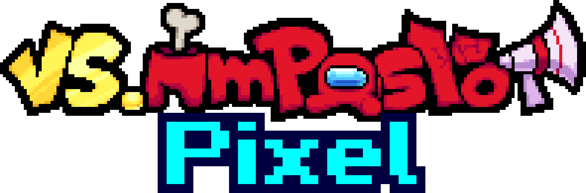

# Friday Night Funkin' - VS IMPOSTOR Pixel

[](LICENSE)
[](#)
[](https://haxe.org/)
[](https://flixel.org/)

**VS IMPOSTOR Pixel** — это модификация для [Friday Night Funkin'](https://ninja-muffin24.itch.io/funkin), основанная на моде [VS IMPOSTOR](https://vsimpostor.com) от команды IMPOSTORM. Мод вдохновлён популярной игрой [Among Us](https://www.innersloth.com/games/among-us) от Innersloth.

<div align="center">
    
</div>

## 📖 История

После победы над Black (в песне Finale из VS IMPOSTOR v4), он не хочет признавать поражение и использует последний трюк: перезапускает временную линию, стирая все воспоминания и превращая всё в пиксели. Теперь Boyfriend возвращается туда, где началось его путешествие во вселенной Among Us, и должен снова встретиться со всеми импосторами и членами экипажа, а также с новыми персонажами, которые сделают его приключение ещё сложнее!

## ✨ Особенности

- 🎮 **Полностью новый пиксель-арт стиль** для всех персонажей и локаций
- 🎵 **Оригинальные треки** от талантливых композиторов
- 📱 **Поддержка мобильных устройств** (Android/iOS) и десктопных платформ
- 🌍 **Мультиязычность**: English, Español, Français, Português, Русский, Deutsch, Tiếng Việt
- 🎯 **Улучшенная система чартов** для более увлекательного геймплея
- 🔧 **Оптимизированный код** на базе Codename Engine

## 🚀 Установка

### Desktop (Windows/Linux/macOS)

1. Скачайте последнюю версию из [GameBanana](https://gamebanana.com/mods/506768) или [Google Drive](https://drive.google.com/drive/folders/1D7bzf95Ig0HuAl6Zrm4iikSvv_Mc0cSm?usp=sharing)
2. Распакуйте архив в любую папку
3. Запустите executable-файл (`ImpostorPixel.exe` на Windows)

### Mobile (Android/iOS)

1. Скачайте APK-файл (Android) или IPA-файл (iOS)
2. Установите файл на ваше устройство
   - **Android**: Разрешите установку из неизвестных источников
   - **iOS**: Используйте AltStore или аналогичный инструмент
3. Запустите игру

### Web (HTML5)

Веб-версия доступна на [GameBanana](https://gamebanana.com/mods/506768) или других хостингах игр.

## 🛠️ Сборка из исходников

### Требования

- [Haxe](https://haxe.org/download/) 4.3+
- [Lime](https://lime.openfl.org/) 8.1+
- [OpenFL](https://www.openfl.org/) 9.3+
- [Flixel](https://flixel.org/) 5.6+
- [Codename Engine](https://codename-engine.com) зависимости

### Установка зависимостей

```bash
# Установка Haxelib менеджера
haxelib setup

# Установка необходимых библиотек
haxelib install lime
haxelib install openfl
haxelib install flixel
haxelib install flixel-addons
haxelib install haxeui-core
haxelib install haxeui-flixel
haxelib install hxdiscord_rpc
haxelib install extension-androidtools
haxelib install extension-haptics
haxelib install hxvlc
```

### Компиляция

```bash
# Windows
lime test windows

# Linux
lime test linux

# macOS
lime test mac

# Android
lime test android

# HTML5
lime test html5

# Debug режим
lime test windows -debug
```

### Очистка проекта

```bash
lime clean
```

## 📁 Структура проекта

```
VS-IMPOSTOR-Pixel/
├── source/                 # Исходный код на Haxe
│   ├── Main.hx            # Точка входа в приложение
│   └── impostor/          # Основные модули игры
│       ├── api/           # API интеграции (Discord RPC)
│       ├── play/          # Игровая логика (PlayState)
│       ├── sound/         # Звуковая система
│       ├── system/        # Системные компоненты (Conductor, FunkinGame)
│       └── ui/            # Пользовательский интерфейс
├── assets/                # Игровые ресурсы (музыка, изображения)
│   └── music/             # Музыкальные треки
├── .artwork/              # Арт-ресурсы и иконки приложения
│   ├── github/            # Изображения для GitHub
│   └── icons/             # Иконки для различных платформ
├── .vscode/               # Настройки VS Code для разработки
├── project.hxp            # Конфигурация проекта Lime/OpenFL
├── hxformat.json          # Настройки форматирования кода Haxe
├── CHANGELOG.md           # История изменений версий
├── LICENSE                # Лицензионное соглашение
├── README.md              # Этот файл
└── CONTRIBUTING.md        # Руководство по внесению вклада
```

## 👥 Команда проекта

### Директор и Программист
- **[kenton](https://github.com/kenton54)**

### Художники, Пиксель-артисты и Аниматоры
- **[kenton](https://github.com/kenton54)**
- **GTM**

### Композиторы
| Композитор | Количество треков |
|------------|-------------------|
| [Sparkly](https://www.youtube.com/@SparklyYea) | 4 |
| [Silte](https://www.youtube.com/@SilteTheMusician) | 1 |

### Чартеры
| Чартер | Количество чартов |
|--------|-------------------|
| [kenton](https://github.com/kenton54) | 17 |
| Kdead | 4 |

### Переводчики
| Переводчик | Язык |
|------------|------|
| [kenton](https://github.com/kenton54) | Español |
| Moxt | Français |
| mikeyguy | Português |
| Fred | Русский |
| Video Fanmade Guy | Deutsch |
| Huy1234TH | Tiếng Việt |

## 📝 Условия использования

✅ **Разрешено:**
- Использовать арт, анимации и код (с указанием авторства)
- Создавать стримы и видео с использованием мода
- Использовать в некоммерческих проектах

❌ **Запрещено:**
- Выдавать работу за свою
- Использовать музыку без разрешения оригинальных авторов
- Коммерческое использование без согласования

> **Важно:** Всегда указывайте оригинальных авторов при использовании материалов мода. Для использования музыкальных треков обращайтесь напрямую к композиторам.

## 🐛 Сообщение об ошибках

Нашли баг или есть предложение по улучшению? Создайте [issue](https://github.com/kenton54/VS-IMPOSTOR-Pixel/issues) в этом репозитории.

Перед созданием issue:
- Проверьте существующие запросы
- Укажите платформу и версию игры
- Приложите скриншоты или логи (если применимо)

## 🔗 Полезные ссылки

- [GameBanana](https://gamebanana.com/mods/506768) — Страница мода на GameBanana
- [Google Drive](https://drive.google.com/drive/folders/1D7bzf95Ig0HuAl6Zrm4iikSvv_Mc0cSm?usp=sharing) — Скачать мод
- [VS IMPOSTOR](https://vsimpostor.com) — Оригинальный мод
- [Codename Engine](https://codename-engine.com) — Движок игры
- [Friday Night Funkin'](https://ninja-muffin24.itch.io/funkin) — Оригинальная игра

## 📄 Лицензия

Этот проект распространяется под лицензией MIT. Подробнее см. файл [LICENSE](LICENSE).

## 🙏 Благодарности

- **Innersloth** — за создание Among Us
- **Ninja Muffin24** и команда FNF — за Friday Night Funkin'
- **Команда IMPOSTORM** — за оригинальный мод VS IMPOSTOR
- **Сообществу FNF** — за поддержку и вдохновение

---

<div align="center">

**Сделано с ❤️ командой VS IMPOSTOR Pixel**

[⬆️ Вернуться к началу](#friday-night-funkin---vs-impostor-pixel)

</div>
